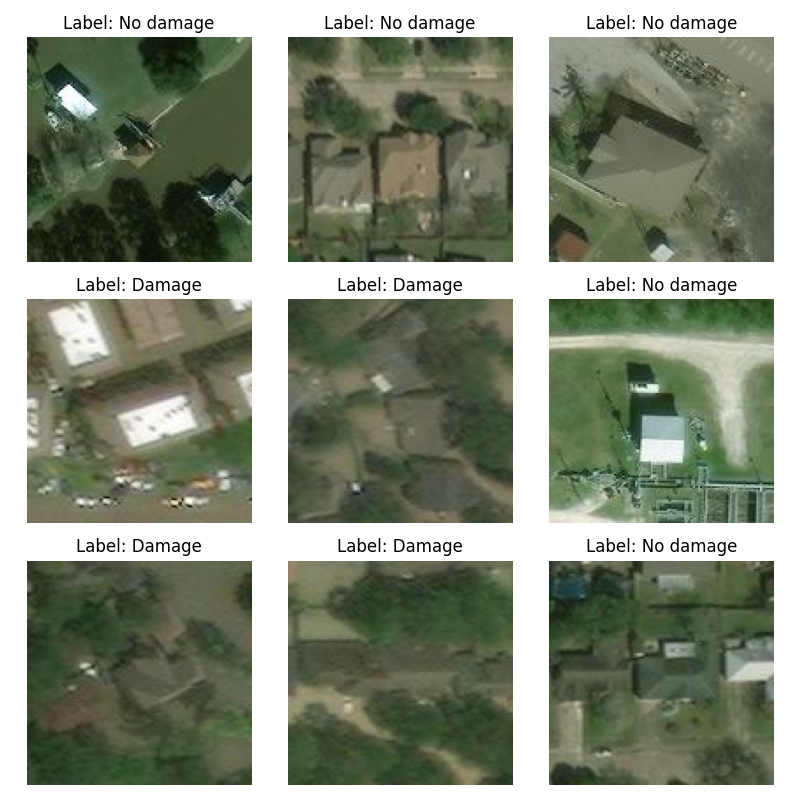

# Hurricane damage classification

The goal of the project is to identify whether a given region contains flooding damage from a satellite image. For this reason, convolutional neural networks (CNNs) are used to classify satellite images into two groups - with damage and without damage:

This is achieved by using two CNNs - AlexNet and VGG16. The AUC of 0.984 is achieved when using AlexNet and the AUC of 0.999 is achieved when using VGG16. 